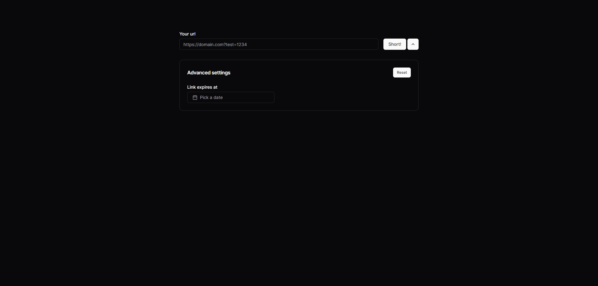

# Link Shortener App

This is a simple web application for shortening URLs. It allows users to input a long URL and optionally specify an expiration date for the shortened link. The application provides advanced settings for managing link expiration and displays the shortened URL along with its expiration date (if specified).

DEMO: [https://link.zkamil.dev/](https://link.zkamil.dev/)

## Features

- Shorten long URLs quickly and easily.
- Customize link expiration date for added control.
- Reset form to default values with a single click.
- Copy shortened URL to clipboard for sharing.

## Technologies Used

- **Next.js**: The application is built using Next.js, a React framework for server-side rendering and static site generation.
- **React**: The frontend is developed using React, a JavaScript library for building user interfaces.
- **Tailwind CSS**: Tailwind CSS is used for styling the user interface, providing a responsive and customizable design system.
- **Supabase**: Supabase is used for API & Auth.
- **React Hook Form**: React Hook Form is used for managing form state and validation in a React application.
- **Tanstack React Query**: Tanstack React Query is used for managing asynchronous data fetching and caching.
- **Zod**: Zod is used for form validation, ensuring that input data adheres to specified schemas.

## Getting Started

1. Clone the repository: `git clone https://github.com/kamilziemann/link-shortener.git`
2. Install dependencies: `pnpm install`
3. Run the development server: `pnpm dev`
4. Open [http://localhost:3000](http://localhost:3000) to view the application in your browser.

## Usage

1. Enter the long URL you want to shorten in the input field labeled "Your url".
2. Optionally, expand the advanced settings section by clicking the downward chevron icon.
3. Specify an expiration date for the shortened link using the "Link expires at" date picker.
4. Click the "Short!" button to generate the shortened URL.
5. Copy the shortened URL using the copy button next to it.
6. Optionally, reset the form to its default values by clicking the "Reset" button.
